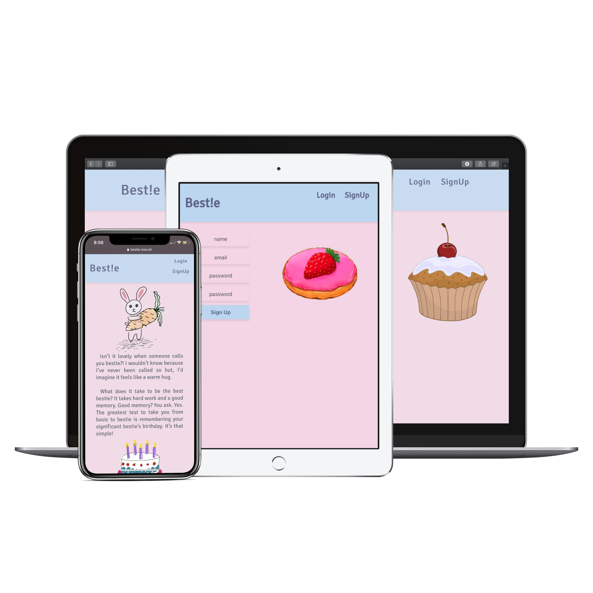
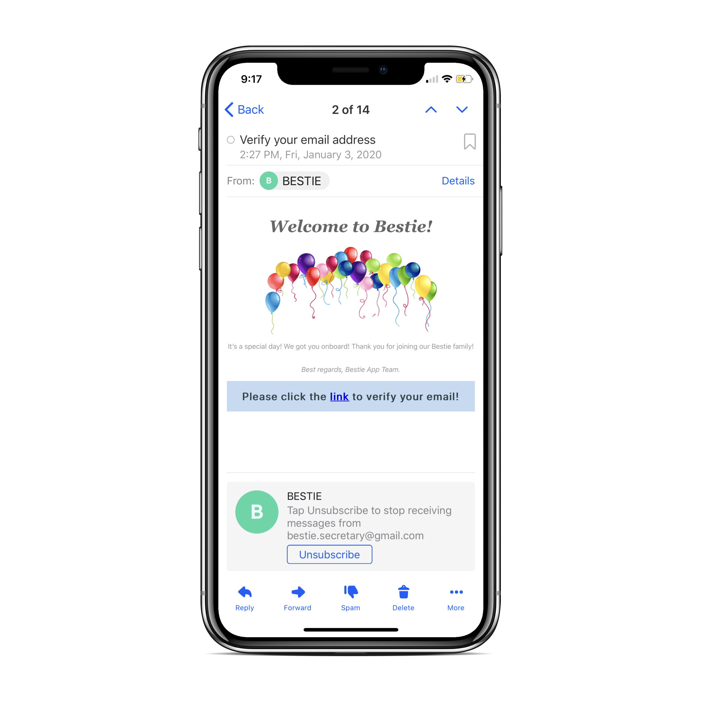
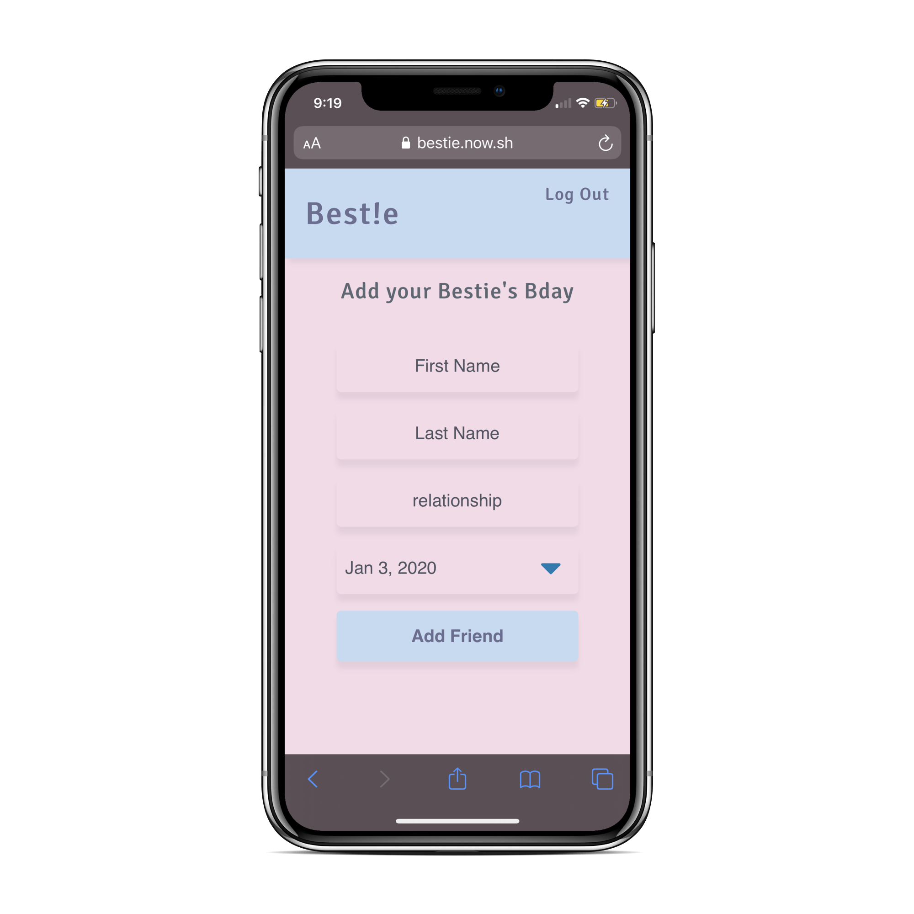
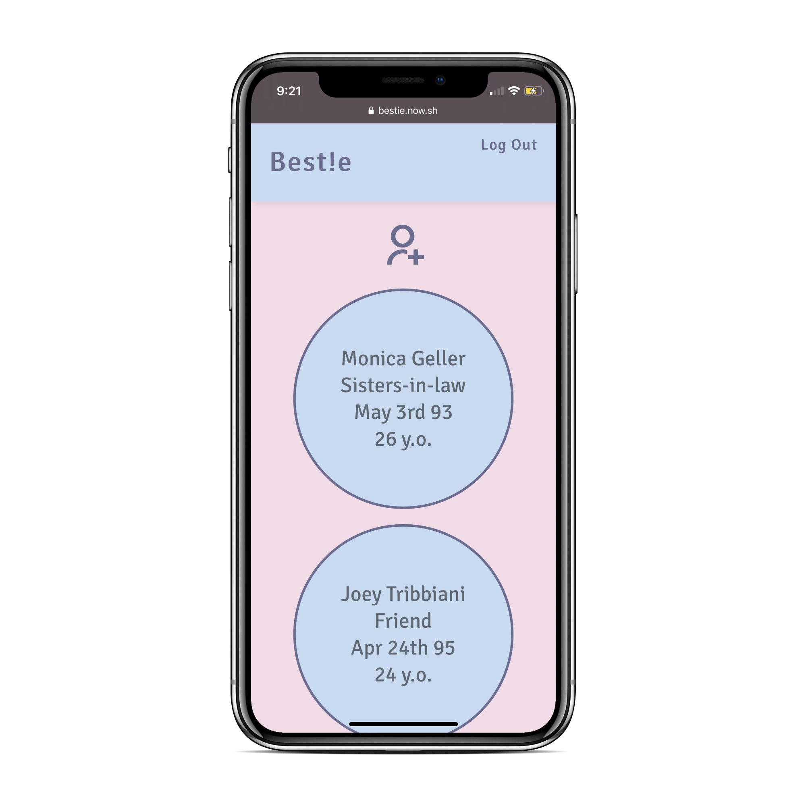
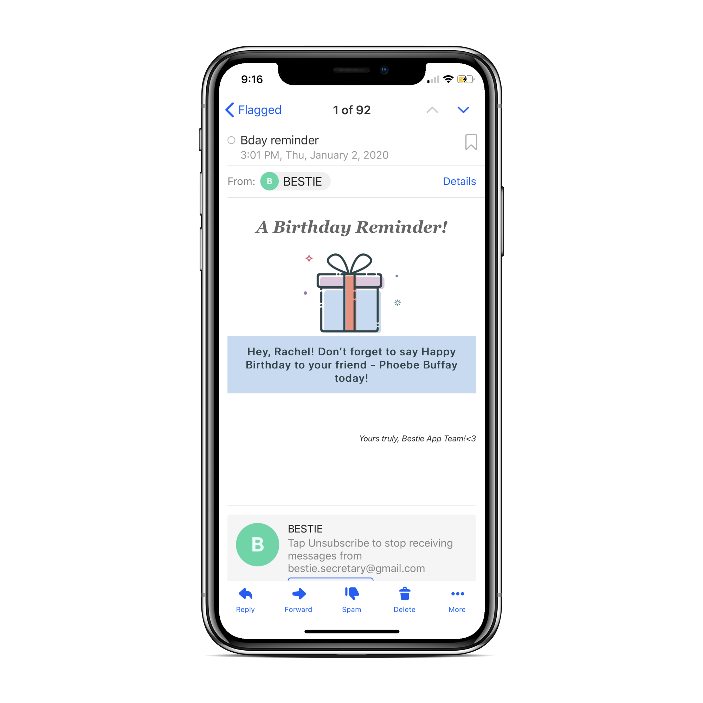
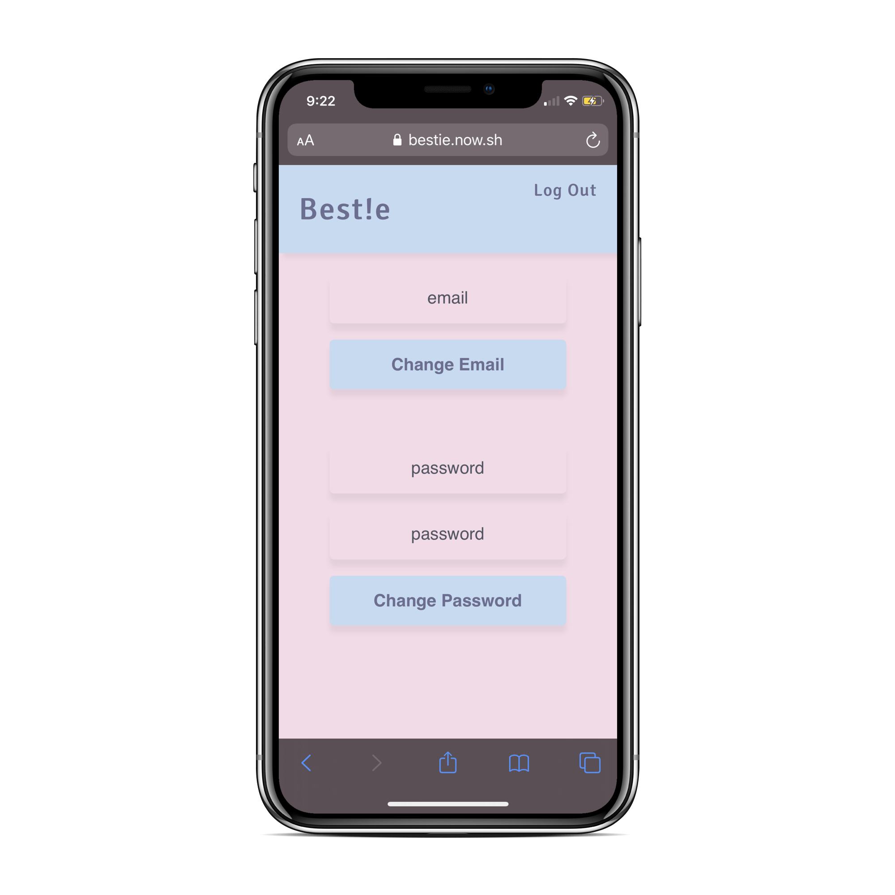
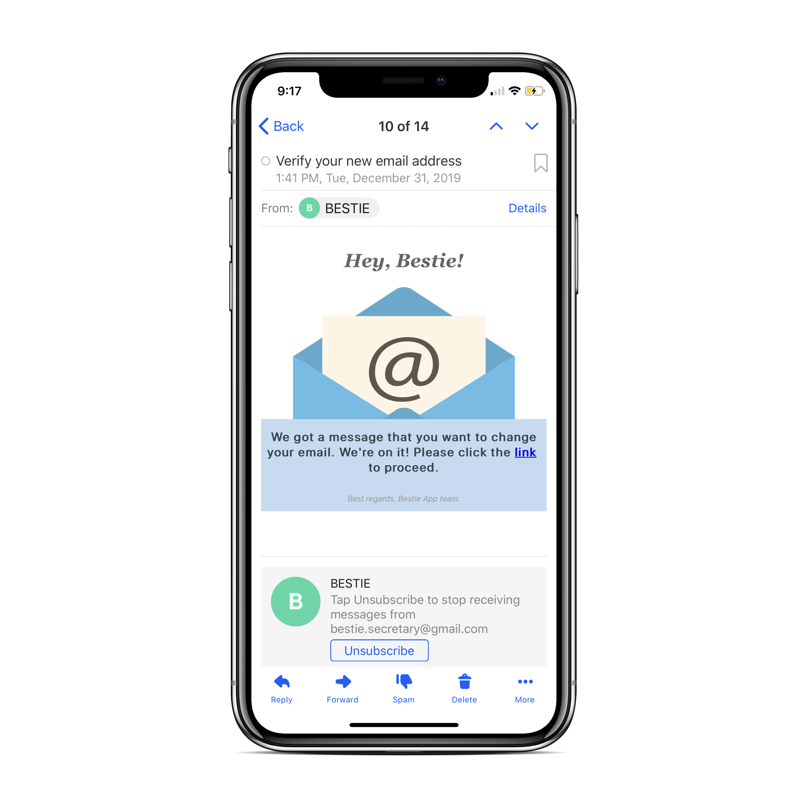
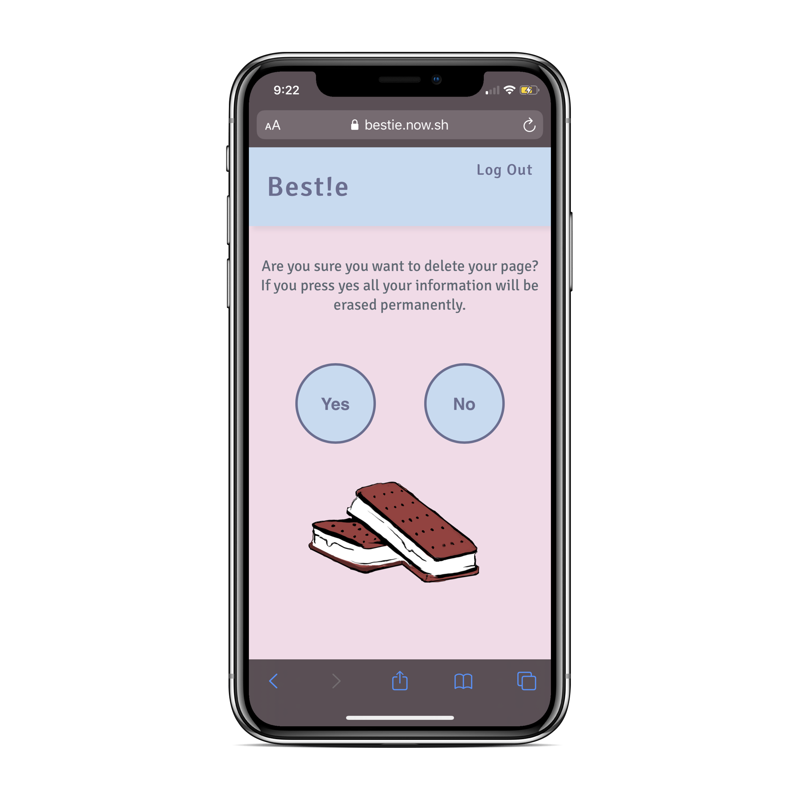

# Bestie

_Bestie_ is an app which sends you email reminders about your friends’ birthdays.

It’s compatible with any device. The style of the app was inspired by my love of sweets and all things kawaii.

In order to start using **the Bestie App** you need to sign up for an account first. As soon as you sign up, **Bestie** will email you a verification link.

Click the link and you're all set! Now you can start using the app. After you login, you will be redirected to the main page where you can find the **"add friend"** button.
Go ahead and add your friend’s info:

- First name
- Last name
- Relationship
- Date of birth

To get back to your page click on **the Bestie logo**. Each of your friends will get their own circle. If you're using a mobile device and you want to delete a friend, tap on the circle and click delete. If you’re using a laptop, hover over a friend and click delete.

When one of your friends has a birthday, **Bestie** will email you a reminder.

Make sure you update **Bestie** if your email changes. You can update your email or password by clicking on the **“edit account"** button from the main page.

For each email update, **Bestie** will email you a verification link to make sure we got it right.

If you ever want to delete your account, click the **"delete account"** button from the main page.

Before deleting your account, **Bestie** will verify this is the correct course of action you want to take. If you press _"Yes"_ your data will be erased permanently.

Excited to start using the app? Check out the [live page](https://bestie.now.sh/).

You can use the foolowing demo user credentials:

- email: user@gmail.com
- password: user
